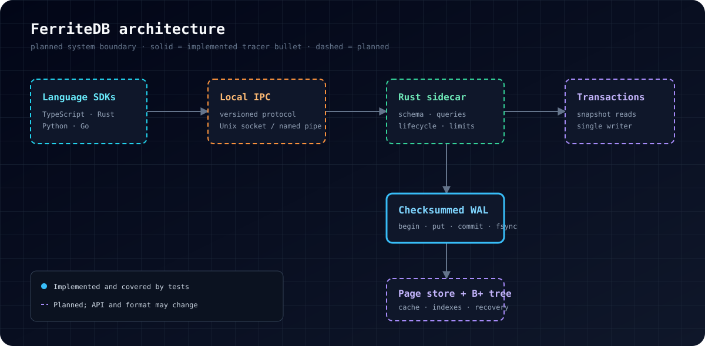

<p align="center">
  
</p>

<p align="center">
  <strong>A local-first database engine built in Rust, designed around explicit durability and language-neutral access.</strong>
</p>

<p align="center">
  <a href="https://github.com/Koray-Ozt/FerriteDB/actions"></a>
  
  
  
</p>

> [!WARNING]
> FerriteDB is an early storage-engine prototype. The current API and on-disk format are unstable. Do not use it for production or irreplaceable data.

## Why FerriteDB?

FerriteDB explores a simple product idea: keep application data local, make successful commits mean something precise, and expose one reliable engine to multiple programming languages without embedding language-specific object formats on disk.

The long-term design combines:

- a Rust storage engine running as an automatically managed local sidecar;
- an open, versioned IPC protocol for language-neutral access;
- a canonical schema with generated, type-safe SDKs;
- snapshot reads, a single serialized writer, and explicit durability modes;
- offline operation with no account, telemetry, license server, or required network access;
- verifiable local backup, recovery, and JSONL data portability.

The repository currently contains the first vertical slice of that design: a checksummed write-ahead log with durable commit markers and conservative recovery.

## Current state

| Capability | State | Notes |
| --- | :---: | --- |
| Checksummed WAL records | ✅ | Length-prefixed `begin`, `put`, and `commit` records |
| Strict commit flush | ✅ | `commit` calls `sync_all` before returning success |
| Committed-only recovery | ✅ | Transactions without a valid commit record stay invisible |
| Corruption detection | ✅ | Truncation, malformed records, and checksum mismatch are rejected |
| Page store and B+ tree | 🚧 | Next storage milestone |
| Crash-injection harness | 🚧 | Planned after WAL replay into the page store |
| Local IPC sidecar | 🧭 | Designed, not implemented |
| TypeScript SDK and schema compiler | 🧭 | Designed, not implemented |
| CLI backup / verify / recover | 🧭 | Designed, not implemented |

Legend: ✅ implemented · 🚧 next milestone · 🧭 planned

## Architecture

<p align="center">
  
</p>

The intended path is deliberately layered:

1. **SDKs** build type-safe requests from a canonical schema.
2. A **versioned local IPC protocol** crosses the language boundary.
3. The **Rust sidecar** owns lifecycle, limits, queries, and transaction ordering.
4. The transaction layer appends to a **checksummed WAL** before mutating durable pages.
5. Recovery replays committed transactions into a **page store and B+ tree indexes**.

Only the WAL slice is implemented today. Dashed components in the diagram are architectural direction, not released functionality.

## WAL invariants

The initial WAL format starts with the `FRTWAL01` magic header. Each record contains a little-endian length, a checksum, a record kind, a transaction ID, and an optional payload.

```text
┌───────────────┬──────────────┬──────────────────────────────┐
│ length (u32)  │ checksum     │ kind + tx id + payload       │
│ little endian │ FNV-1a/u32   │ begin | put | commit         │
└───────────────┴──────────────┴──────────────────────────────┘
```

Current recovery rules:

- a transaction becomes visible only after a valid commit record;
- an interrupted transaction is ignored rather than partially exposed;
- a malformed or checksum-invalid record returns an explicit corruption error;
- a commit is acknowledged only after the WAL file is flushed with `sync_all`.

This format is a tracer bullet. Compatibility is **not** promised until a stable-format milestone is declared.

## Build and verify

FerriteDB currently requires a recent Rust toolchain with Edition 2024 support.

```bash
git clone https://github.com/Koray-Ozt/FerriteDB.git
cd FerriteDB

cargo test --workspace
cargo clippy --workspace --all-targets -- -D warnings
cargo fmt --all --check
```

Focused recovery tests:

```bash
cargo test -p ferrite-core --test wal_recovery
```

## Repository layout

```text
FerriteDB/
├── crates/
│   └── ferrite-core/
│       ├── src/
│       │   ├── lib.rs
│       │   └── wal.rs
│       └── tests/
│           └── wal_recovery.rs
├── docs/
│   └── assets/
├── Cargo.toml
└── README.md
```

## Reliability target

FerriteDB's planned strict-durability contract is:

> If a strict commit returns success, the transaction should survive a process crash or power loss; after recovery, the transaction is either fully visible or absent.

The current WAL implementation establishes only part of that contract. End-to-end durability still requires page-store replay, directory and metadata ordering, checkpointing, and systematic process-kill and power-loss testing.

## Roadmap

### Storage foundation

- [x] Checksummed WAL record encoding
- [x] Durable commit marker
- [x] Committed-only recovery
- [ ] Atomic WAL replay into a page-backed key/value store
- [ ] Page checksums, cache, and B+ tree indexes
- [ ] Checkpointing and bounded WAL growth
- [ ] Process-kill crash-injection matrix

### Product surface

- [ ] `database.ferrite` schema language
- [ ] Versioned local IPC protocol and sidecar lifecycle
- [ ] TypeScript/Node.js SDK
- [ ] Collection CRUD, primary keys, unique indexes, and typed filters
- [ ] Local `verify`, `backup`, `restore`, `recover`, import, and export CLI
- [ ] Rust, Python, and Go SDKs

## Non-goals for the first release

- cloud hosting or remote database access;
- browser, mobile, serverless, or edge runtimes;
- raw SQL compatibility;
- multi-writer or distributed consensus;
- transparent encryption before key management and recovery semantics are designed.

## Contributing and security

Read [CONTRIBUTING.md](CONTRIBUTING.md) before proposing storage changes. Durability, recovery, and format changes must carry focused tests and an explicit statement of changed invariants.

Security reports should follow [SECURITY.md](SECURITY.md). Please do not open public issues for suspected vulnerabilities.

## Licensing

The intended distribution model is **source-available**, not OSI open source: applications may use and bundle FerriteDB without charge, while standalone redistribution, rebranding, resale, and competing managed-database offerings are intended to be restricted.

The final legal text has not been published yet and requires specialist review. Until a license file is added, **no permission to copy, modify, or redistribute the source is granted beyond rights provided by applicable law**.

---

<p align="center">
  Built for software that should keep working when the network does not.
</p>
