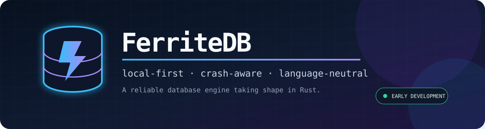

<p align="center">
  
</p>

<p align="center"><strong>A small local JSON document/key-value database with explicit durable commits and a language-neutral sidecar.</strong></p>

> [!WARNING]
> FerriteDB is an **unaudited MVP**. Its API, protocol, and on-disk format are unstable. Do not use it for production or irreplaceable data.

## MVP capabilities

- persistent JSON key/value records and atomic multi-operation put/delete transactions;
- checksummed WAL, committed-only recovery, explicit corruption failures, and bounded untrusted lengths;
- optional JSON collection schema with string primary keys and unique fields, rebuilt and checked on restart;
- local-only version 1 NDJSON protocol over Unix domain sockets;
- direct `put`, `get`, `delete`, `list`, `verify`, `backup`, `restore`, `export`, and `import` commands;
- dependency-light TypeScript SDK that starts and owns the Rust sidecar.

## Build and try it

```bash
cargo build -p ferrite-cli
DB=$(mktemp -d)/example
./target/debug/ferrite put "$DB" greeting '{"text":"hello"}'
./target/debug/ferrite get "$DB" greeting
./target/debug/ferrite list "$DB"
./target/debug/ferrite verify "$DB"
./target/debug/ferrite export "$DB" export.jsonl
```

Commands never overwrite backup, restore, export, or import destinations. Backup, restore, export, and import are built in owner-only hidden sibling staging paths and published with an atomic no-replace rename only after verification/sync succeeds. Export destinations must be outside the source database directory. A crash or validation failure can leave a hidden `.ferrite-staging-*` artifact for manual inspection, but the requested destination is never exposed as complete and cleanup never recursively deletes a path that another process may have replaced. A database directory is created if absent. Commits and newly created database metadata are fsynced before success. Stored schema metadata must be a non-symlink regular file no larger than 1 MiB and is opened with bounded, non-blocking reads. JSONL exports include stored schema metadata as the first line, and import restores it before applying records so primary-key and unique constraints survive a round trip.

A schema is JSON:

```json
{
  "collections": {
    "users": { "primary_key": "id", "unique": ["email"] }
  }
}
```

Start the sidecar with it:

```bash
./target/debug/ferrite serve ./app-db --socket /tmp/ferrite.sock --schema ./schema.json
```

The versioned protocol accepts one JSON object per line and returns one response per line:

```json
{"version":1,"id":1,"method":"put","key":"users/u1","value":{"id":"u1","email":"ada@example.com"}}
{"version":1,"id":2,"method":"transaction","operations":[{"Put":{"key":"a","value":1}},{"Delete":{"key":"b"}}]}
```

## TypeScript SDK

```bash
cd sdk/typescript
npm ci --include=dev
npm run build
```

```ts
import { FerriteDB } from "@ferritedb/sdk";

const db = await FerriteDB.open("./app-db", { binary: "./target/debug/ferrite" });
await db.put("settings/theme", { dark: true });
console.log(await db.get("settings/theme"));
await db.transaction([
  { Put: { key: "counter", value: 1 } },
  { Delete: { key: "obsolete" } }
]);
await db.close();
```

## Verify the repository

```bash
cargo fmt --all --check
cargo test --workspace --all-targets
cargo clippy --workspace --all-targets -- -D warnings
cd sdk/typescript
npm run build
FERRITE_BIN=../../target/debug/ferrite npm test
FERRITE_BIN=../../target/debug/ferrite npm run e2e
```

## Limits and limitations

The MVP limits keys to 4 KiB, JSON values and WAL records to about 1 MiB, transactions to 1,024 operations/8 MiB, and a WAL file to 64 MiB. There is no checkpointing, so writes eventually reach the WAL limit. The database uses an in-memory ordered map rebuilt from the WAL at startup; it is not a page store or B+ tree. An advisory file lock enforces one writer process per database. The sidecar handles at most 64 clients in connection workers with a 30-second read timeout while serializing database operations through one process-local lock.

Unix sockets make the sidecar and SDK **Linux/macOS only**. There is no Windows transport, remote TCP, authentication, encryption, SQL, distributed replication, telemetry, or cloud service. Backup holds the source writer lock for the complete verified copy and therefore rejects a running writer instead of producing a concurrent snapshot. Fully written but uncommitted WAL transactions are ignored during recovery; a physically truncated WAL tail is reported as corruption and is never repaired in place. Durability has not received systematic power-loss testing or an independent security audit.

## Layout

- `crates/ferrite-core`: database, schema validation, constraints, WAL and recovery
- `crates/ferrite-cli`: direct commands and local Unix-socket sidecar
- `sdk/typescript`: Node.js SDK and real sidecar-to-disk e2e test

See [CONTRIBUTING.md](CONTRIBUTING.md) and [SECURITY.md](SECURITY.md). The intended model is source-available; until final legal text is published, no additional license grant is implied.
